# PostGIS Entity-Relationship Diagram

This ERD documents every table in `db/schema.sql` — the canonical source of
truth for the warehouse. GitHub renders the Mermaid block below inline.

## Schema overview

```
raw schema      -> 6 ingestion tables + 1 audit log
staging schema  -> 2 canonical tables (flood_events, social_flood_signals)
marts schema    -> 8 views built from staging (see transformations/marts.py)
```

## Full ERD (Mermaid)

```mermaid
erDiagram
    %% =========================================================
    %% RAW SCHEMA — original payloads preserved as JSONB
    %% =========================================================
    raw_dartmouth_events {
        BIGSERIAL id PK
        TEXT source
        TEXT source_url
        TEXT file_path
        TEXT batch_id
        TIMESTAMPTZ ingested_at
        JSONB payload
    }

    raw_glofas_events {
        BIGSERIAL id PK
        TEXT source
        TEXT source_url
        TEXT file_path
        TEXT batch_id
        TIMESTAMPTZ ingested_at
        JSONB payload
    }

    raw_copernicus_ems_events {
        BIGSERIAL id PK
        TEXT source
        TEXT source_url
        TEXT file_path
        TEXT batch_id
        TIMESTAMPTZ ingested_at
        JSONB payload
    }

    raw_emdat_events {
        BIGSERIAL id PK
        TEXT source
        TEXT source_url
        TEXT file_path
        TEXT batch_id
        TIMESTAMPTZ ingested_at
        JSONB payload
    }

    raw_reliefweb_events {
        BIGSERIAL id PK
        TEXT source
        TEXT source_url
        TEXT file_path
        TEXT batch_id
        TIMESTAMPTZ ingested_at
        JSONB payload
    }

    raw_social_media_posts {
        BIGSERIAL id PK
        TEXT platform UK
        TEXT post_id UK
        TEXT source
        TEXT source_url
        TEXT file_path
        TEXT batch_id
        TIMESTAMPTZ ingested_at
        JSONB payload
    }

    raw_ingestion_log {
        BIGSERIAL id PK
        TEXT batch_id
        TEXT source
        TEXT source_url
        TEXT file_path
        TEXT file_checksum
        INTEGER rows_ingested
        TEXT status
        TEXT message
        TIMESTAMPTZ started_at
        TIMESTAMPTZ finished_at
    }

    %% =========================================================
    %% STAGING SCHEMA — canonical unified model
    %% =========================================================
    staging_flood_events {
        SERIAL id PK
        TEXT source UK
        TEXT source_event_id UK
        TEXT event_name
        TEXT main_cause
        TIMESTAMP date_start
        TIMESTAMP date_end
        TEXT country
        TEXT river_basin
        DOUBLE latitude
        DOUBLE longitude
        GEOMETRY_Point_4326 geometry
        INTEGER deaths
        INTEGER displaced
        INTEGER affected
        DOUBLE severity
        DOUBLE flood_impact_index
        TEXT glide_number
        TEXT url
        TEXT h3_index
        TIMESTAMPTZ loaded_at
    }

    staging_social_flood_signals {
        BIGSERIAL id PK
        TEXT platform UK
        TEXT post_id UK
        TEXT source_event_id FK
        TIMESTAMPTZ created_at
        TIMESTAMPTZ ingested_at
        TEXT text
        TEXT language
        TEXT url
        TEXT author_id_hash
        TEXTARRAY matched_keywords
        TEXTARRAY excluded_keywords
        DOUBLE flood_relevance_score
        DOUBLE location_confidence
        DOUBLE signal_confidence
        TEXT place_name
        TEXT country
        DOUBLE latitude
        DOUBLE longitude
        GEOMETRY_Point_4326 geometry
        TEXT h3_index
        JSONB raw_payload
        TIMESTAMPTZ loaded_at
    }

    %% =========================================================
    %% MARTS SCHEMA — API-ready views (all CREATE OR REPLACE VIEW)
    %% =========================================================
    marts_flood_events {
        SERIAL id
        TEXT source
        TEXT source_event_id
        TEXT event_name
        TEXT main_cause
        TIMESTAMP date_start
        TIMESTAMP date_end
        TEXT country
        TEXT river_basin
        DOUBLE latitude
        DOUBLE longitude
        JSON geometry_geojson
        INTEGER deaths
        INTEGER displaced
        INTEGER affected
        DOUBLE severity
        DOUBLE flood_impact_index
        TEXT glide_number
        TEXT url
        TEXT h3_index
        TIMESTAMPTZ loaded_at
    }

    marts_flood_events_unique {
        SERIAL id
        TEXT source
        TEXT source_event_id
        TEXT event_name
        TEXT main_cause
        TIMESTAMP date_start
        TIMESTAMP date_end
        TEXT country
        TEXT river_basin
        DOUBLE latitude
        DOUBLE longitude
        JSON geometry_geojson
        INTEGER deaths
        INTEGER displaced
        INTEGER affected
        DOUBLE severity
        DOUBLE flood_impact_index
        TEXT glide_number
        TEXT url
        TEXT h3_index
        TIMESTAMPTZ loaded_at
    }

    marts_social_flood_signals {
        BIGSERIAL id
        TEXT platform
        TEXT post_id
        TEXT source_event_id
        TIMESTAMPTZ created_at
        TIMESTAMPTZ ingested_at
        TEXT text
        TEXT language
        TEXT url
        TEXT author_id_hash
        TEXTARRAY matched_keywords
        TEXTARRAY excluded_keywords
        DOUBLE flood_relevance_score
        DOUBLE location_confidence
        DOUBLE signal_confidence
        TEXT place_name
        TEXT country
        DOUBLE latitude
        DOUBLE longitude
        JSON geometry_geojson
        TEXT h3_index
        TIMESTAMPTZ loaded_at
    }

    marts_social_signals_by_country_day {
        TEXT country
        DATE signal_date
        BIGINT signal_count
        DOUBLE avg_signal_confidence
        BIGINT high_confidence_count
        TEXTARRAY platforms
        TEXTARRAY languages
    }

    marts_flood_events_with_social_signals {
        SERIAL id
        TEXT source
        TEXT source_event_id
        TEXT event_name
        TIMESTAMP date_start
        TIMESTAMP date_end
        TEXT country
        TEXT river_basin
        DOUBLE latitude
        DOUBLE longitude
        JSON geometry_geojson
        INTEGER deaths
        INTEGER displaced
        INTEGER affected
        DOUBLE severity
        TEXT h3_index
        BIGINT social_signal_count
        TIMESTAMPTZ first_social_signal_at
        TIMESTAMPTZ latest_social_signal_at
        DOUBLE avg_social_signal_confidence
        TEXTARRAY social_platforms
    }

    marts_flood_events_by_region {
        TEXT country
        BIGINT event_count
        BIGINT total_deaths
        BIGINT total_displaced
        BIGINT total_affected
        DOUBLE avg_severity
        TIMESTAMP earliest_event
        TIMESTAMP latest_event
    }

    marts_flood_events_by_h3 {
        TEXT h3_index
        BIGINT event_count
        DOUBLE avg_severity
        BIGINT total_deaths
        TIMESTAMP earliest_event
        TIMESTAMP latest_event
    }

    marts_flood_frequency_by_basin {
        TEXT basin
        TEXT basin_source
        INTEGER year
        BIGINT event_count
        DOUBLE avg_severity
    }

    marts_flood_events_by_month {
        DATE month
        BIGINT event_count
        DOUBLE avg_severity
        BIGINT total_deaths
    }

    %% =========================================================
    %% LINEAGE (logical, not declared FK — JSONB feeds normalization)
    %% =========================================================
    raw_dartmouth_events        ||--o{ staging_flood_events           : "normalize"
    raw_glofas_events           ||--o{ staging_flood_events           : "normalize"
    raw_copernicus_ems_events   ||--o{ staging_flood_events           : "normalize"
    raw_emdat_events            ||--o{ staging_flood_events           : "normalize"
    raw_reliefweb_events        ||--o{ staging_flood_events           : "normalize"
    raw_social_media_posts      ||--o{ staging_social_flood_signals   : "filter+score"

    %% Cross-staging join (used by marts.flood_events_with_social_signals)
    staging_flood_events        ||--o{ staging_social_flood_signals   : "h3+time join"

    %% staging -> marts (projections and dedup)
    staging_flood_events        ||--o{ marts_flood_events              : "flat projection"
    staging_flood_events        ||--o{ marts_flood_events_unique       : "dedup DFO Register#"
    staging_social_flood_signals ||--o{ marts_social_flood_signals     : "flat projection"
    staging_social_flood_signals ||--o{ marts_social_signals_by_country_day : "rollup by country+day"

    %% marts -> marts (rollups from the deduped canonical view)
    marts_flood_events_unique   ||--o{ marts_flood_events_by_region    : "rollup by country"
    marts_flood_events_unique   ||--o{ marts_flood_events_by_h3        : "rollup by h3 cell"
    marts_flood_events_unique   ||--o{ marts_flood_events_by_month     : "rollup by month"
    marts_flood_events_unique   ||--o{ marts_flood_frequency_by_basin  : "rollup by basin+year"
    marts_flood_events_unique   ||--o{ marts_flood_events_with_social_signals : "left join social"
    staging_social_flood_signals ||--o{ marts_flood_events_with_social_signals : "h3+time match"
```



## Notes on the diagram

- **JSONB → canonical normalization**: the lineage arrows from `raw.*` to
  `staging.flood_events` are *logical*, not declared foreign keys. Each
  raw row's JSONB `payload` is parsed by a source-specific normalizer in
  [transformations/transform.py](../transformations/transform.py), which
  upserts into `staging.flood_events` keyed by
  `(source, source_event_id)`.
- **Social link**: `staging.social_flood_signals` has a logical FK to
  `raw.social_media_posts` via the
  `(platform, post_id)` natural key — enforced by DQ check #15
  (`social_orphan_staging_signals`).
- **Marts are views, not tables**: every object under `marts.*` is a
  `CREATE OR REPLACE VIEW` defined in
  [transformations/marts.py](../transformations/marts.py); they refresh
  from `staging.*` on every read, so there is no separate ETL step for
  the marts layer.
- **Dedup rule**: `marts.flood_events_unique` collapses the ~73%
  Register# overlap between `Dartmouth_MasterList` (live) and
  `Dartmouth_FO` (HDX-frozen 2019). It also fixes intra-source `2507` vs
  `DFO_2507` collisions. Every analytical rollup is built on
  `flood_events_unique`, not on `staging.flood_events`, so analytics never
  double-count.
- **Spatial join**: `marts.flood_events_with_social_signals` joins
  `flood_events_unique` to `staging.social_flood_signals` on either
  matching `h3_index` (preferred) or matching lower-case `country`,
  within a temporal window of `[date_start - 1d, date_end + 3d]` and
  only for signals with `signal_confidence > 0`.

## Mart catalogue

| Mart view | Type | Built from | Purpose |
|---|---|---|---|
| `marts.flood_events` | flat projection | `staging.flood_events` | Audit view that preserves both DFO vintages; geometry exposed as GeoJSON. **Not exposed via API.** |
| `marts.flood_events_unique` | deduped projection | `staging.flood_events` | Canonical event view for analytics. Strips `DFO_` prefix and prefers `Dartmouth_MasterList` over `Dartmouth_FO`. |
| `marts.flood_events_by_region` | rollup | `marts.flood_events_unique` | Per-country event count, total deaths/displaced/affected, avg severity, date range. |
| `marts.flood_events_by_h3` | rollup | `marts.flood_events_unique` | Per-H3-cell event count, avg severity, total deaths, date range. |
| `marts.flood_events_by_month` | rollup | `marts.flood_events_unique` | Monthly time-series (event count, avg severity, total deaths). |
| `marts.flood_frequency_by_basin` | rollup | `marts.flood_events_unique` | Yearly frequency per river basin (falls back to country when basin is null; `basin_source` tells consumers which). |
| `marts.flood_events_with_social_signals` | join | `marts.flood_events_unique` ⋈ `staging.social_flood_signals` | Deduped event enriched with nearby social-signal count, first/latest timestamp, avg confidence, distinct platforms. |
| `marts.social_flood_signals` | flat projection | `staging.social_flood_signals` | Geometry exposed as GeoJSON for API consumption. |
| `marts.social_signals_by_country_day` | rollup | `staging.social_flood_signals` | Per-country, per-day signal count, avg confidence, high-confidence count, distinct platforms and languages. |

## API endpoint → mart mapping

The FastAPI service reads **only** from marts (never raw or staging). Source:
[api/main.py](../api/main.py) `_MART_VIEWS`.

| Endpoint | Mart view |
|---|---|
| `GET /flood-events` | `marts.flood_events_unique` |
| `GET /flood-events/by-region` | `marts.flood_events_by_region` |
| `GET /flood-events/by-time` | `marts.flood_events_unique` |
| `GET /flood-events/by-severity` | `marts.flood_events_unique` |
| `GET /flood-events/by-h3` | `marts.flood_events_by_h3` + `marts.flood_events_unique` |
| `GET /flood-events/with-social-signals` | `marts.flood_events_with_social_signals` |
| `GET /social-signals` | `marts.social_flood_signals` |
| `GET /analytics/by-month` | `marts.flood_events_by_month` |
| `GET /analytics/by-source` | `marts.flood_events_unique` (group-by source) |
| `GET /analytics/frequency-by-basin` | `marts.flood_frequency_by_basin` |
| `GET /analytics/social-signals/by-platform` | `marts.social_flood_signals` (group-by platform) |
| `GET /analytics/social-signals/by-country-day` | `marts.social_signals_by_country_day` |

## PostGIS / geometry specifics

| Column | Type | Notes |
|---|---|---|
| `staging.flood_events.geometry` | `GEOMETRY(Point, 4326)` | WGS-84 lat/lon, GiST index (`ix_flood_events_geom`) |
| `staging.social_flood_signals.geometry` | `GEOMETRY(Point, 4326)` | WGS-84 lat/lon, GiST index (`ix_social_flood_signals_geom`) |
| `*.h3_index` | `TEXT` | Uber H3 resolution 7 (~5 km hex edge) |

## Indexes (all defined in [db/schema.sql](../db/schema.sql))

**`staging.flood_events`**: `country`, `river_basin`, `date_start`,
`severity`, `h3_index`, `geometry` (GiST).

**`staging.social_flood_signals`**: `platform`, `created_at`, `country`,
`h3_index`, `signal_confidence`, `geometry` (GiST).

**`raw.social_media_posts`**: `platform`, `ingested_at`.

## Rendering as PNG / SVG (optional)

If you need a raster image for the report appendix:

```bash
# Option A: Mermaid CLI
npm install -g @mermaid-js/mermaid-cli
mmdc -i docs/erd.md -o docs/erd.png -t neutral -b transparent

# Option B: paste the DBML in docs/erd.dbml into https://dbdiagram.io
#          then Export -> PNG/PDF
```
