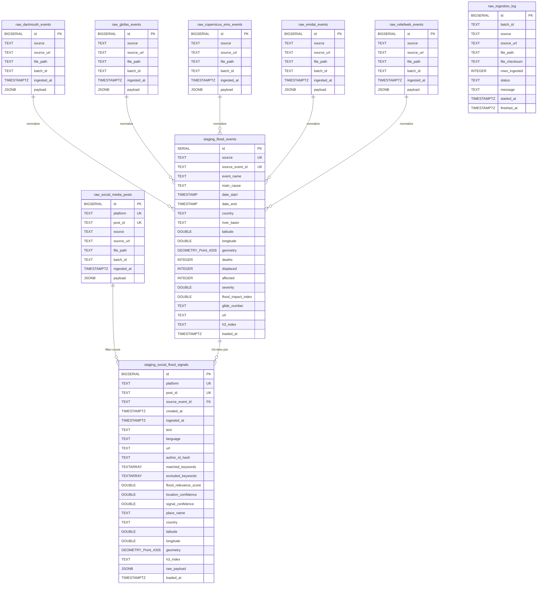

# PostGIS Entity-Relationship Diagram

This ERD documents every table in `db/schema.sql` — the canonical source of
truth for the warehouse. GitHub renders the Mermaid block below inline.

## Schema overview

```
raw schema      -> 6 ingestion tables + 1 audit log
staging schema  -> 2 canonical tables (flood_events, social_flood_signals)
marts schema    -> 8 views built from staging (see transformations/marts.py)
```

## Full ERD (Mermaid)



## Notes on the diagram

- **JSONB → canonical normalization**: the lineage arrows from `raw.*` to
  `staging.flood_events` are *logical*, not declared foreign keys. Each
  raw row's JSONB `payload` is parsed by a source-specific normalizer in
  [transformations/transform.py](../transformations/transform.py), which
  upserts into `staging.flood_events` keyed by
  `(source, source_event_id)`.
- **Social link**: `staging.social_flood_signals` has a logical FK to
  `raw.social_media_posts` via the
  `(platform, post_id)` natural key — enforced by DQ check #15
  (`social_orphan_staging_signals`).
- **Spatial join**: the mart view
  `marts.flood_events_with_social_signals` joins
  `staging.flood_events` to `staging.social_flood_signals` on
  `h3_index` plus a temporal window.

## PostGIS / geometry specifics

| Column | Type | Notes |
|---|---|---|
| `staging.flood_events.geometry` | `GEOMETRY(Point, 4326)` | WGS-84 lat/lon, GiST index (`ix_flood_events_geom`) |
| `staging.social_flood_signals.geometry` | `GEOMETRY(Point, 4326)` | WGS-84 lat/lon, GiST index (`ix_social_flood_signals_geom`) |
| `*.h3_index` | `TEXT` | Uber H3 resolution 7 (~5 km hex edge) |

## Indexes (all defined in [db/schema.sql](../db/schema.sql))

**`staging.flood_events`**: `country`, `river_basin`, `date_start`,
`severity`, `h3_index`, `geometry` (GiST).

**`staging.social_flood_signals`**: `platform`, `created_at`, `country`,
`h3_index`, `signal_confidence`, `geometry` (GiST).

**`raw.social_media_posts`**: `platform`, `ingested_at`.

## Rendering as PNG / SVG (optional)

If you need a raster image for the report appendix:

```bash
# Option A: Mermaid CLI
npm install -g @mermaid-js/mermaid-cli
mmdc -i docs/erd.md -o docs/erd.png -t neutral -b transparent

# Option B: paste the DBML in docs/erd.dbml into https://dbdiagram.io
#          then Export -> PNG/PDF
```
